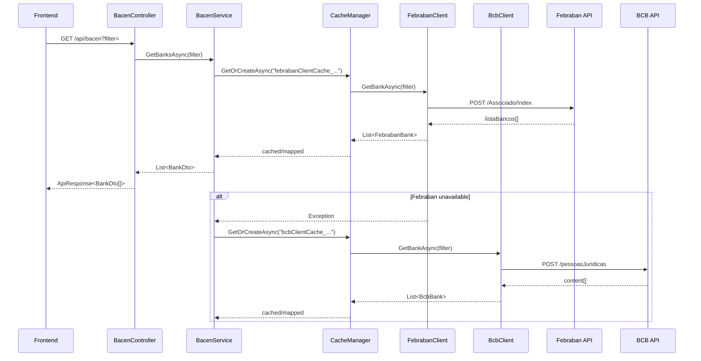

# EAF Template BFF


> **English (en-US)** is the default language for this README. A [Portuguese (pt-BR) version is available here](docs/README.md).

## Project Description

**EAF Template BFF** is a .NET 10 **Back-end for Front-end (BFF)** template that exposes normalized data from Brazilian financial institutions (Bacen, BCB, and Febraban) to frontend applications. It applies **Clean Architecture**, **SOLID** principles, and resilience patterns, providing a single, secure, and cacheable integration point for external APIs.

- Centralizes communication with legacy and unstable APIs.
- Implements fallback from Febraban (primary) to BCB (secondary).
- Uses compressed distributed caching to reduce latency and external service load.
- Provides observability through OpenTelemetry and structured logging with Serilog.

## Repository Structure

```
.
├── src/
│   ├── Eaf.Template.Bff.Core/        # Domain logic, services, cache, middleware, extensions
│   ├── Eaf.Template.Bff.Proxy/       # HTTP clients for Bacen/BCB and Febraban
│   └── Eaf.Template.Bff.Host/        # ASP.NET Core API, controllers, and Swagger
├── tests/
│   └── Eaf.Template.Bff.Tests/       # xUnit tests with Moq, FluentAssertions, Shouldly, and NSubstitute
├── .github/workflows/                  # CI/CD, quality, and security pipelines
├── docs/                               # Complementary documentation in Portuguese
├── .claude/                            # Claude Code agent harness settings and rules
├── .devin/                             # Devin agent harness settings and hooks
├── CLAUDE.md                         # Agent harness index
├── README.md                         # This file (en-US)
└── CHANGELOG.md                      # Changelog
```

### Layer Details

- **`src/Eaf.Template.Bff.Core`** — Domain logic, services (`BacenService`), cache (`CacheManager`), exception handling middleware, DI extensions, AutoMapper profiles, and OpenTelemetry/Serilog configuration.
- **`src/Eaf.Template.Bff.Proxy`** — `FebrabanClient` and `BcbClient` HTTP clients with `BaseUrl` normalization, Newtonsoft.Json serialization, and specific JSON response handling.
- **`src/Eaf.Template.Bff.Host`** — Controllers (`BacenController`, `BaseController`), `Startup`, `Program`, and Swagger.
- **`tests/Eaf.Template.Bff.Tests`** — Tests organized in `Features/{Cache,Clients,Controllers,Extensions,Mappings,Models,Services}` with fake helpers (`FakeCacheManager`, `FakeDistributedCache`, `MockHttpMessageHandler`).

## Technology Stack

| Layer | Technology |
|-------|-----------|
| Runtime | .NET 10.0 / C# 14 |
| Web API | ASP.NET Core |
| Mapping | AutoMapper 16.2.0 |
| Logging | Serilog (Console, ASP.NET Core, Settings Configuration) |
| Observability | OpenTelemetry 1.17.0 (ASP.NET Core, Http, Runtime, OTLP, Prometheus) |
| Resilience | Microsoft.Extensions.Http.Resilience 10.8.0 |
| Cache | `IDistributedCache` with GZip compression |
| Authentication | JWT Bearer (Microsoft.AspNetCore.Authentication.JwtBearer 10.0.10) |
| API Documentation | Swashbuckle.AspNetCore 10.2.3 + Microsoft.OpenApi 3.9.0 |
| Serialization | Newtonsoft.Json 13.0.4 |
| Tests | xUnit, Moq, FluentAssertions 8.10.0, Shouldly 4.3.0, NSubstitute 6.0.0 |
| CI/CD | GitHub Actions |
| Quality | SonarCloud/SonarQube, Snyk, CodeQL, Qodana |
| Container | Docker (Alpine Linux) |

## Architecture

The project follows **Clean Architecture** with three main layers:

1. **Core (Domain/Application)** — Independent of external frameworks. Contains business rules, services, contracts (`IBacenService`, `ICacheManager`), and models.
2. **Proxy (Infrastructure)** — HTTP clients and adapters for external APIs. Depends only on infrastructure libraries.
3. **Host (Presentation)** — ASP.NET Core API, controllers, middleware, and DI configuration. Depends on `Core` and `Proxy`.

### Applied Patterns

- **BFF (Back-end for Front-end)** — Dedicated endpoint that aggregates and adapts data for frontend consumers.
- **DDD** — Separation between entities, value objects, domain services, and repositories where applicable.
- **SOLID** — Constructor-based dependency injection, single responsibility, and dependency inversion.
- **Resilience** — Fallback between Febraban and BCB; sliding and absolute cache expiration.
- **Observability** — OpenTelemetry + Serilog for tracing, metrics, and structured logs.

## System Flow



## How to Run

### Prerequisites

- [.NET 10.0 SDK](https://dotnet.microsoft.com/download/dotnet/10.0)
- Docker (optional)

### Commands

```bash
# Clone
https://github.com/afonsoft/bff.git
cd bff

# Restore
dotnet restore Eaf.Template.Bff.sln

# Build
dotnet build Eaf.Template.Bff.sln --configuration Release

# Tests
dotnet test tests/Eaf.Template.Bff.Tests/Eaf.Template.Bff.Tests.csproj

# Run locally
dotnet run --project src/Eaf.Template.Bff.Host
```

Open Swagger at `http://localhost:4000/swagger` (or the port configured in `ASPNETCORE_URLS`).

### Docker

```bash
docker build -t eaf-template-bff .
docker run -d -p 5000:5000 -e DOTNET_PROCESSOR_COUNT=2 eaf-template-bff
```

### Relevant Environment Variables

| Variable | Description | Default |
|----------|-------------|---------|
| `API_URL_BCB` | BCB service base URL | `https://www3.bcb.gov.br/informes/rest/pessoasJuridicas` |
| `API_URL_FEBRABAN` | Febraban service base URL | `https://portal.febraban.org.br/Associado/Index` |
| `ASPNETCORE_URLS` | Application URLs | `http://+:4000` |
| `DOTNET_PROCESSOR_COUNT` | CPU cores | `2` |

## Tests and Coverage

```bash
# Tests with coverage
dotnet test tests/Eaf.Template.Bff.Tests/Eaf.Template.Bff.Tests.csproj \
  --configuration Release \
  --collect:"XPlat Code Coverage" \
  --results-directory ./TestResults
```

| Metric | Value |
|--------|-------|
| Total Tests | 37 |
| Passing Tests | 37 |
| Line Coverage | 27.91% (211/756) |
| Branch Coverage | 15.89% (41/258) |
| Core | 26.44% |
| Host | 7.22% |
| Proxy | 86.11% |

> The project target is **90% coverage**. The `Proxy` layer is already well covered; `Core` and `Host` still need additional tests for middlewares, controllers, extensions, and configurations.

## Business Vision

The BFF acts as a **secure and resilient facade** between the frontend and the public services of the Brazilian financial system. It reduces integration complexity for the client, hides contract differences between Febraban and BCB, improves performance through caching, and ensures high availability through automatic fallback.

## Technical Vision

- **Dependency Injection**: Services and clients are registered through `ServiceCollectionExtensions`.
- **Distributed Cache**: `CacheManager` serializes (Newtonsoft.Json) and compresses (GZip) values before storing in `IDistributedCache`.
- **Resilience**: `HttpClient` from `IHttpClientFactory` with policies from `Microsoft.Extensions.Http.Resilience`.
- **Observability**: `OpenTelemetryExtensions` configures tracing, metrics, and OTLP/Prometheus exporters.
- **Security**: JWT Bearer, CORS, sanitized headers, and centralized exception middleware.
- **Documentation**: Swagger with annotations and standardized `ApiResponse<T>`.

## Developers / Contributors

See the contribution history in [CHANGELOG.md](./CHANGELOG.md).

## License

This project is licensed under the MIT License. See [LICENSE](./LICENSE).

## Project Status

**Active development.**

- Build: passing
- Tests: 37/37 passing
- Vulnerabilities: none detected (`dotnet list package --vulnerable`)
- Coverage: improving (target 90%)

## Links

- [CHANGELOG.md](./CHANGELOG.md)
- [Portuguese documentation (docs/README.md)](./docs/README.md)
- [Technology stack (docs/technologies.md)](./docs/technologies.md)
- [Packages and dependencies (docs/packages.md)](./docs/packages.md)
- [Features (docs/features.md)](./docs/features.md)
- [API reference (docs/api.md)](./docs/api.md)
- [Issues](https://github.com/afonsoft/bff/issues)
- [Actions](https://github.com/afonsoft/bff/actions)
